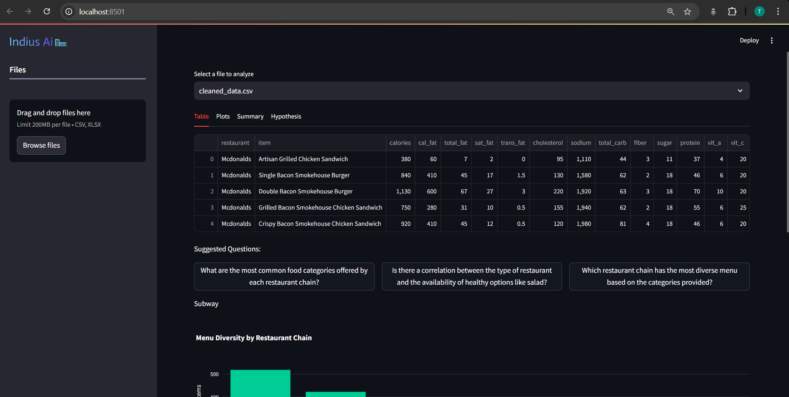
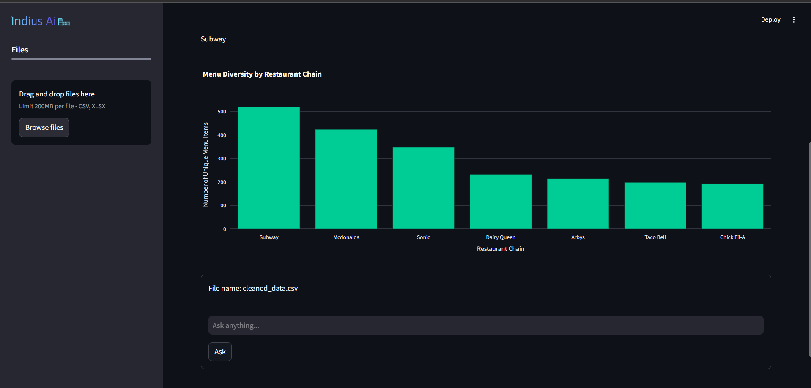
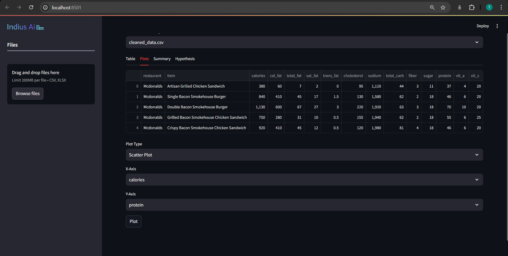
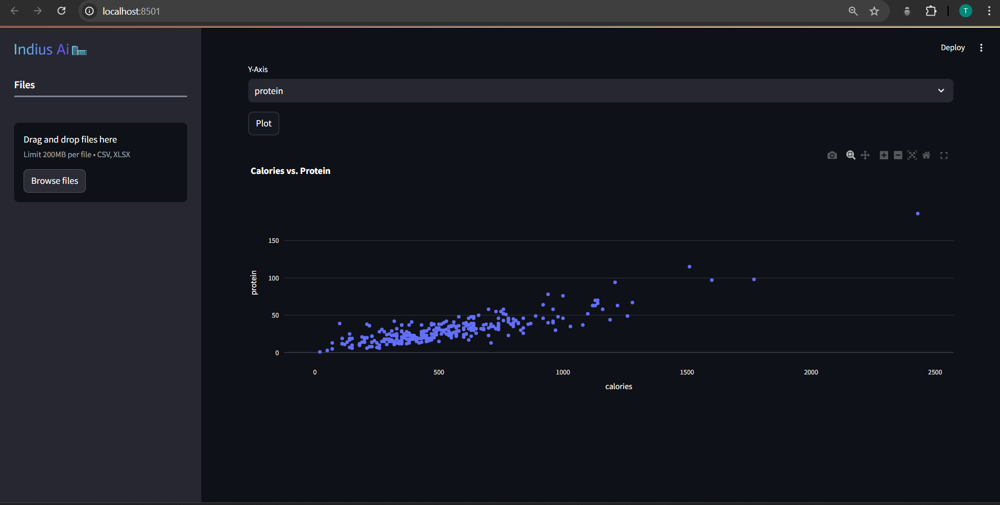
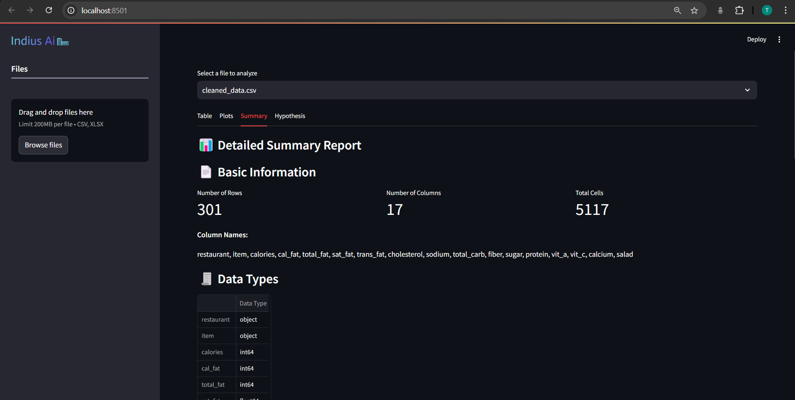
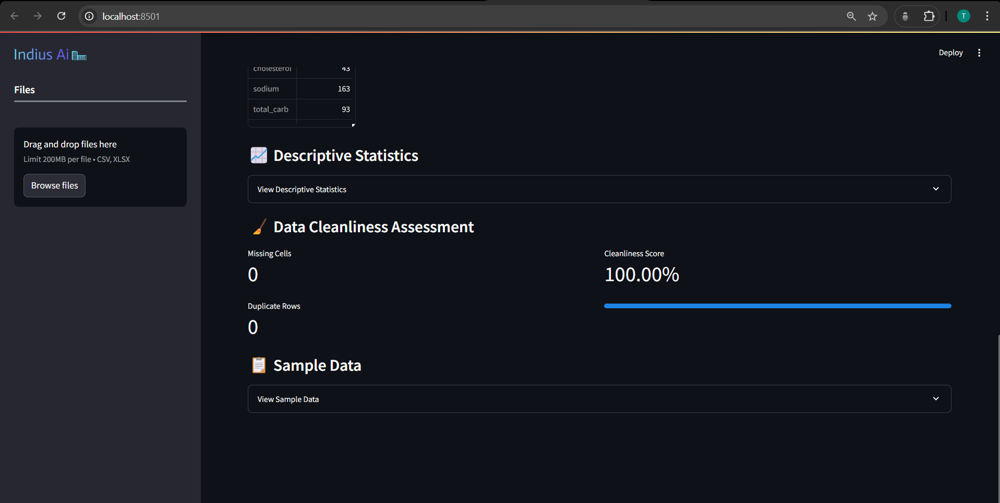
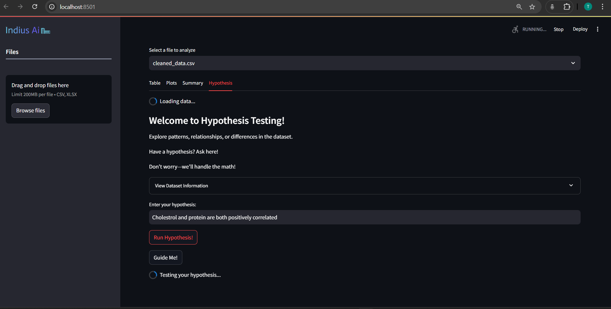
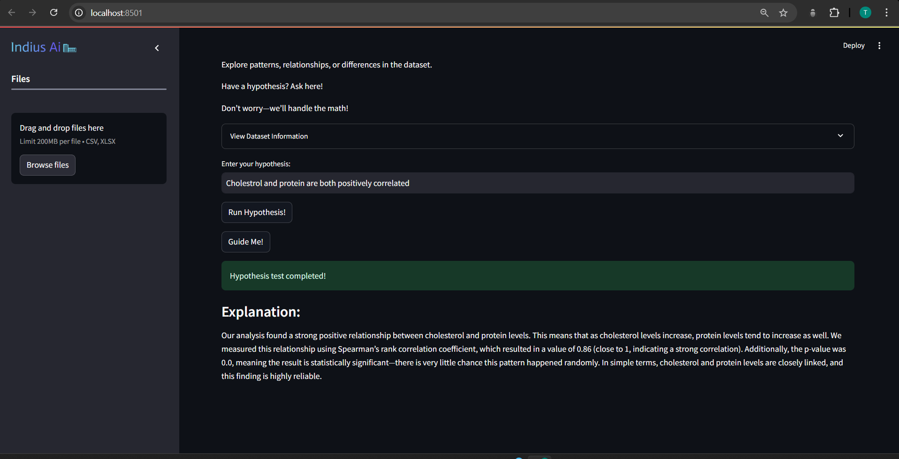

# Indius AI  

**Indius AI** is an **AI-powered Data Science & Analytics platform** designed to transform **raw data into intelligent insights.** Unlike traditional AI tools, it is built specifically for **non-coders** and individuals outside the data science domain. The platform can analyze datasets, summarize key insights, perform **advanced hypothesis testing (e.g., Chi-Square tests),** and generate **visualizations**—all without requiring repeated user prompts.  

Indius AI leverages **SmolAgent**, a powerful agent-based framework, to automate complex data analysis workflows. **SmolAgent allows the platform to perform multi-step tasks autonomously without requiring constant human intervention**—a feature that distinguishes it from conventional LLM-based tools.  

---

## 📷 Screenshots & Demo  

### 🖼️ Screenshots  
  
  
  
  
  
  
  
  

### 🎥 Demo Video  
Demo: https://youtu.be/SFp_4gy-Cn4
---

## 🚀 Key Features  

### 📝 Data Summary & Quality Check  
Provides a quick overview of dataset properties, ensuring data integrity before analysis.
Examples include:  
✔ **Basic Overview**: Number of rows, columns, data types, and memory usage.  
✔ **Missing Values**: Identifies and reports missing values in the dataset.  
✔ **Duplicate Entries**: Detects and highlights duplicate records.  

### 📊 Data Visualization & Analysis  
Generates meaningful visual representations of data trends and distributions. 
Examples include:  
✔ **Histograms** for distribution analysis.  
✔ **Box plots** for outlier detection.  
✔ **Scatter plots** for correlation analysis.  
✔ **Bar and Pie charts** for categorical data insights.  

### 🔎 AI-Powered Prompting for Data Understanding  
Allows users to interact with the dataset by asking questions.
Examples include:  
✔ *"What are the key trends in this dataset?"*  
✔ *"Which column has the highest variance?"*  
✔ *"Can you summarize the correlation between variables?"*  

### 📊 Advanced Hypothesis Testing  
Performs statistical tests to validate assumptions about the dataset. Examples include:  
✔ **Chi-Square Test** for categorical relationships.  
✔ **t-Test** for comparing group means.  
✔ **ANOVA** for multi-group comparisons.  
✔ **Correlation tests (Pearson/Spearman/Kendall).**  

### 📂 Seamless File Upload & Processing  
Allows users to upload their datasets effortlessly.
Examples include:  
✔ **CSV and Excel file uploads** for instant analysis.  
✔ **Automatic data parsing** and structure detection.  
✔ **Error-free preprocessing** using SmolAgent.  

---

## ⚙️ SmolAgent-Powered Intelligence  

Unlike traditional LLM-based analytics tools that require continuous user prompting, **Indius AI leverages SmolAgent for:**
✔ **Autonomous Data Exploration**: Detects dataset properties and generates key insights without intervention.  
✔ **Multi-Step Execution**: Performs statistical tests, generates reports, and visualizes data in a single workflow.  
✔ **Adaptive Reasoning**: Dynamically selects the most appropriate analysis technique based on data properties.  

This means **users do not need extensive data science knowledge**—the platform guides them through the analysis automatically.  

---

## 🛠️  Usage  

Just Clone it and Run `streamlit run main.py`

Navigate to http://localhost:8501

Upload a CSV/Excel file

Explore automated insights, visualizations, and hypothesis tests

## 🔥 Why Use Indius AI?

✅ **No Coding Required** – Built for non-programmers and business users.

✅ **SmolAgent-Powered** – Automates analysis steps, reducing manual effort.

✅ **Hypothesis Testing** – Built-in statistical evaluation for decision-making.

✅ **AI-Powered Prompting** – Intelligent Q&A on your dataset.

✅ **Interactive Visualizations** – Generate insights visually with ease.

## 📜 License

This project is licensed under the MIT License. See LICENSE for details.

💡 Indius AI – Making Data Science Effortless for Everyone! 🚀
